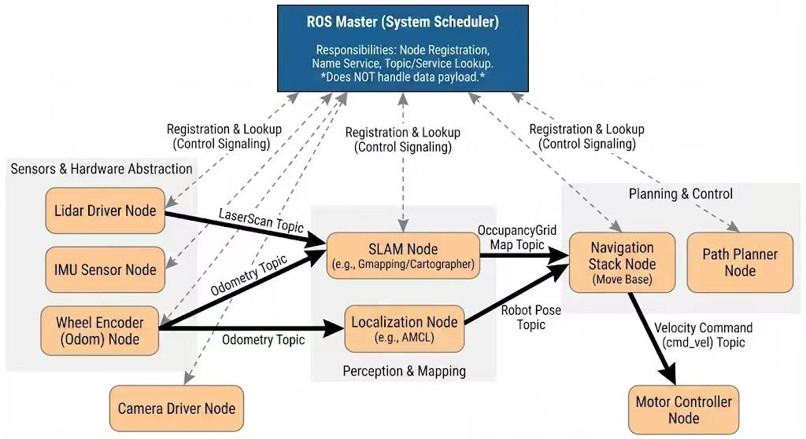

## 3.1 ROS 系统架构与运行模型

###  ROS 的整体架构

ROS 并不是一个单一程序，而是由多个独立进程协同组成的系统。
 其核心设计思想是 **分布式与模块化**。

在 ROS 系统中，主要包含以下角色：

- **ROS Master**：
   系统的调度中心，负责节点注册与发现。
- **Node（节点）**：
   实际运行的程序，每个节点完成一个具体功能。

ROS Master 本身并不传输数据，而是帮助节点建立通信关系。

------

