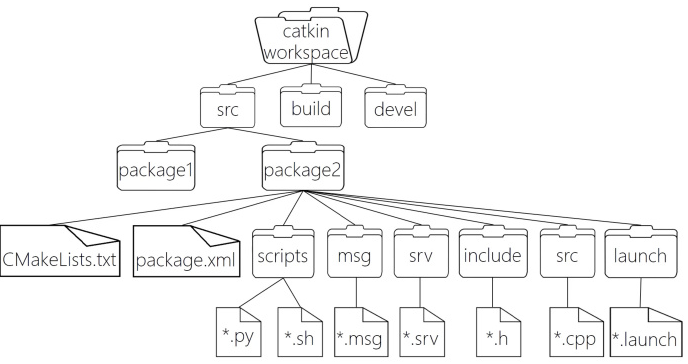

# 第三章 ROS 核心基础与程序实践

------

## 本章导读

在前两章中，我们已经完成了 ROS 的整体认识以及开发环境的搭建。从本章开始，我们将正式进入 ROS 的“核心世界”，回答一个关键问题：

> **ROS 程序究竟是如何组织、运行并协同工作的？**

本章将围绕 ROS 的系统架构、文件系b统以及程序实践展开。你将亲手创建工作空间、功能包和节点，并最终运行一个完整的 ROS 系统，而不仅仅是“敲代码”

## 本章学习目标

完成本章学习后，你将能够：

- 理解 ROS 的**整体架构与运行模型**
- 熟悉 ROS 的**文件系统**结构及各文件的作用
- 了解熟悉ROS的基本常用命令
- 独立创建 **ROS 工作空间与功能包**
- 编写并运行一个基于 **C++** 的 ROS 节点
- 使用 **launch** 文件启动和管理 ROS 系统
- 使用可视化工具理解 ROS 系统运行关系

------

## 3.1 ROS 系统架构与运行模型

### 3.1.1 ROS 的整体架构

ROS 并不是一个单一程序，而是由多个独立进程协同组成的系统。
 其核心设计思想是 **分布式与模块化**。


在 ROS 系统中，主要包含以下角色：

- **ROS Master**：
   系统的调度中心，负责节点注册与发现。
- **Node（节点）**：
   实际运行的程序，每个节点完成一个具体功能。

ROS Master 本身并不传输数据，而是帮助节点建立通信关系。

------

## 3.2 ROS 文件系统与组织结构

### 3.2.1 ROS 文件系统概览

与普通 C/C++ 工程不同，ROS 对代码的组织方式有明确规范：

- 所有代码必须位于 **工作空间（workspace）** 
- 所有功能必须封装为 **功能包（package）**

这种结构化设计使 ROS 项目具备良好的可维护性和可复用性。

------

### 3.2.2 工作空间（Workspace）结构

以 catkin 工作空间为例，其基本结构如下：

```
catkin_ws/
├── src/
├── build/
├── devel/
```

各目录含义：

- `src`：存放所有 ROS 功能包/源码
- `build`：编译过程中生成的中间文件
- `devel`：开发阶段生成的环境配置文件，包括头文件、动态&静态链接库、可执行文件等。

ROS 通过 `setup.bash` 将工作空间加入系统环境。




```
WorkSpace --- 自定义的工作空间

    |--- build:编译空间，用于存放 CMake 与 catkin 生成的缓存、配置文件以及各类中间编译文件

    |--- devel:开发空间，保存编译后生成的结果文件，包括头文件、库文件（动态库 / 静态库）以及可执行程序，同时包含用于配置开发环境的脚本

    |--- src: 源码空间，所有 ROS 功能包必须存放在该目录下

        |-- package：功能包(ROS基本单元)包含多个节点、库与配置文件，包名所有字母小写，只能由字母、数字与下划线组成

            |-- CMakeLists.txt 功能包的编译规则配置文件，用于指定源文件、依赖关系以及生成目标

            |-- package.xml 功能包描述文件，记录包名、版本、作者及依赖信息

            |-- scripts 存放 Python 节点脚本文件

            |-- src 存放 C++ 源代码文件

            |-- include 存放功能包对应的头文件

            |-- msg 自定义消息（Message）类型文件

            |-- srv 自定义服务（Service）类型文件

            |-- action 自定义动作（Action）通信格式文件

            |-- launch 启动文件目录，用于一次性启动多个节点

            |-- config 参数与配置文件目录

        |-- CMakeLists.txt: 功能包的编译规则配置文件，用于指定源文件、依赖关系以及生成目标
```

------


## 3.3 ROS1 常用命令


### 3.3.1 环境与系统启动

| 命令                      | 作用                                          |
| ------------------------- | --------------------------------------------- |
| `roscore`                 | 启动 ROS 系统（Master、参数服务器、日志节点） |
| `roscore -p xxxx`         | 指定端口号启动 ROS Master                     |
| `source devel/setup.bash` | 刷新当前终端 ROS 环境                         |

### 3.3.2 工作空间与功能包

| 命令                            | 作用                     |
| ------------------------------- | ------------------------ |
| `catkin_create_pkg 包名 依赖包` | 创建新的 ROS 功能包      |
| `catkin_make`                   | 编译当前 catkin 工作空间 |
| `sudo apt install xxx`          | 安装系统级 ROS 功能包    |

### 3.3.3 功能包管理

| 命令                | 作用                        |
| ------------------- | --------------------------- |
| `rospack list`      | 列出所有已识别的 ROS 功能包 |
| `rospack find 包名` | 查找功能包路径              |
| `roscd 包名`        | 进入指定功能包目录          |
| `rosls 包名`        | 查看功能包内文件            |
| `apt search xxx`    | 搜索可安装的 ROS 功能包     |

### 3.3.4 节点运行

| 命令                        | 作用                       |
| --------------------------- | -------------------------- |
| `rosrun 包名 节点名`        | 运行单个 ROS 节点          |
| `roslaunch 包名 launch文件` | 运行 launch 文件（多节点） |

### 3.3.5 rosnode

`rosnode` 用于查看和管理 ROS 系统中节点的运行状态，是进行节点调试与系统诊断的重要工具。

| 命令              | 功能说明                                          |
| ----------------- | ------------------------------------------------- |
| `rosnode ping`    | 测试与指定节点之间的连接状态                      |
| `rosnode list`    | 列出当前系统中所有正在运行的 ROS 节点             |
| `rosnode info`    | 显示指定节点的详细信息（发布/订阅的话题、服务等） |
| `rosnode machine` | 列出在指定设备（主机）上运行的节点                |
| `rosnode kill`    | 终止指定的 ROS 节点                               |
| `rosnode cleanup` | 清理已注册但无法连接的无效节点                    |

### 3.3.6 rostopic

`rostopic` 用于查看、发布和分析 ROS 话题通信，是理解节点之间数据流动的核心工具

| 命令             | 功能说明                               |
| ---------------- | -------------------------------------- |
| `rostopic bw`    | 显示指定话题的带宽使用情况             |
| `rostopic delay` | 显示带有 `header` 的话题通信延迟       |
| `rostopic echo`  | 将话题中的消息实时打印到终端           |
| `rostopic find`  | 根据消息类型查找对应的话题             |
| `rostopic hz`    | 显示话题的发布频率                     |
| `rostopic info`  | 显示话题的详细信息（发布者、订阅者等） |
| `rostopic list`  | 列出当前系统中所有处于活动状态的话题   |
| `rostopic pub`   | 向指定话题发布数据                     |
| `rostopic type`  | 显示话题对应的消息类型                 |

### 3.3.7 rosmsg

`rosmsg` 用于查看和管理 ROS 中的消息类型，是理解话题通信数据结构的核心工具。

| 命令              | 功能说明                           |
| ----------------- | ---------------------------------- |
| `rosmsg show`     | 显示指定消息类型的详细结构描述     |
| `rosmsg info`     | 显示消息的基本信息                 |
| `rosmsg list`     | 列出系统中所有可用的消息类型       |
| `rosmsg md5`      | 显示指定消息类型对应的 MD5 校验值  |
| `rosmsg package`  | 显示某个功能包中定义的所有消息类型 |
| `rosmsg packages` | 列出包含消息定义的所有功能包       |

### 3.3.8 rosservice

`rosservice` 是用于查看、调用和调试 ROS 服务通信机制的核心命令行工具。

| 命令              | 功能说明                       |
| ----------------- | ------------------------------ |
| `rosservice args` | 显示指定服务所需的参数格式     |
| `rosservice call` | 使用给定参数调用指定服务       |
| `rosservice find` | 根据服务类型查找可用的服务     |
| `rosservice info` | 显示服务的详细信息             |
| `rosservice list` | 列出当前系统中所有活动的服务   |
| `rosservice type` | 显示指定服务对应的服务类型     |
| `rosservice uri`  | 显示服务对应的 ROSRPC 通信地址 |

### 3.3.9 rossrv

`rossrv` 用于查看和管理 ROS 中的服务类型定义，是理解服务通信接口结构的重要工具
| 命令              | 功能说明                           |
| ----------------- | ---------------------------------- |
| `rossrv show`     | 显示指定服务类型的详细消息结构     |
| `rossrv info`     | 显示服务消息的基本信息             |
| `rossrv list`     | 列出系统中所有可用的服务类型       |
| `rossrv md5`      | 显示指定服务类型对应的 MD5 校验值  |
| `rossrv package`  | 显示某个功能包中定义的所有服务类型 |
| `rossrv packages` | 列出包含服务定义的所有功能包       |

### 3.3.10 rosparam

`rosparam` 用于管理 ROS 参数服务器中的参数，是实现系统配置与运行时调节的重要工具。

| 命令              | 功能说明                                  |
| ----------------- | ----------------------------------------- |
| `rosparam set`    | 设置指定参数的值                          |
| `rosparam get`    | 获取指定参数的当前值                      |
| `rosparam load`   | 从外部文件（如 YAML）加载参数到参数服务器 |
| `rosparam dump`   | 将参数服务器中的参数导出到外部文件        |
| `rosparam delete` | 删除指定参数                              |
| `rosparam list`   | 列出当前参数服务器中的所有参数            |

## 3.4 ROS 小海龟（turtlesim）运行与系统认识

在正式编写自己的 ROS 节点之前，我们先通过一个**官方示例程序**来直观认识 ROS 系统的运行方式。
 `turtlesim`（小海龟）是 ROS 提供的经典入门示例，用于演示节点运行、话题通信和工具使用。

> 本节目标：
>  **不写代码，通过运行现成程序，理解 ROS 系统是“怎么跑起来的”。**

------

### 3.4.1 什么是 turtlesim

`turtlesim` 是 ROS 自带的一个图形化仿真程序，主要用于：

- 演示 ROS 节点的运行方式
- 展示基于话题（Topic）的通信机制
- 辅助学习 ROS 常用调试工具

小海龟并不是真实机器人，但其运行模式与真实机器人系统完全一致。

------

### 3.4.2 启动 ROS Master（必要步骤）

在运行任何 ROS 程序之前，必须先启动 ROS Master。

在**新终端**中执行：

```
roscore
```

启动成功后，ROS 系统进入待命状态。

------

### 3.4.3 启动 turtlesim 节点

在**另一个终端**中运行：

```
rosrun turtlesim turtlesim_node
```

成功后，会弹出一个窗口，显示一只小海龟。

**说明**

- `turtlesim_node` 是一个 ROS 节点
- 它在启动时会自动向 ROS Master 注册
- 并创建多个话题和服务接口

------

### 3.4.4 启动键盘控制节点

`turtlesim` 提供了一个现成的控制节点，用于通过键盘控制小海龟运动。

在**第三个终端**中运行：

```
rosrun turtlesim turtle_teleop_key
```

在该终端中按下方向键，小海龟会在窗口中移动。

------

### 3.4.5 使用 rosnode 观察系统节点

查看当前系统中运行的节点：

```
rosnode list
```

你将看到类似输出：

```
/rosout
/turtlesim
/teleop_turtle
```

### 节点说明

| 节点名           | 作用                 |
| ---------------- | -------------------- |
| `/turtlesim`     | 小海龟仿真节点       |
| `/teleop_turtle` | 键盘控制节点         |
| `/rosout`        | 日志节点（系统自动） |

------

### 3.4.6 使用 rostopic 查看通信关系

列出系统中所有话题：

```
rostopic list
```

你会看到诸如：

```
/turtle1/cmd_vel
/turtle1/pose
```

其中：

- `/turtle1/cmd_vel`：控制速度的话题
- `/turtle1/pose`：小海龟当前位置与姿态


## 3.5  ROS 工作空间与功能包创建

### 3.5.1  创建新的工作空间

```
mkdir -p ~/catkin_ws/src
cd ~/catkin_ws
catkin_make
```

----------

`catkin_make` 是 ROS1 中用于 **编译 catkin 工作空间** 的核心命令。

它会完成以下工作：

- 检查当前目录是否为 catkin 工作空间（是否包含 `src` 目录）
- 读取工作空间中所有功能包的 `CMakeLists.txt` 和 `package.xml`
- 自动生成：
  - `build/`：编译中间文件
  - `devel/`：开发环境与可执行文件
- 编译所有功能包中的源码

**使用前提：**当前路径必须是 **工作空间根目录**（如 `~/catkin_ws`）

**一句话总结**：

> `catkin_make` 用于“把 ROS 功能包变成可以运行的程序”。

----------

**完成后，需要刷新环境变量：**

```
source devel/setup.bash
```

---

`source`命令用于 **刷新当前终端的 ROS 环境变量**，让系统“认识”刚刚编译生成的功能包和节点。

`source devel/setup.bash` 是告诉 ROS：“我这个工作空间现在可以用了”。

---

### 3.5.2 创建 ROS 功能包

```
cd ~/catkin_ws/src
catkin_create_pkg hello_ros roscpp std_msgs
```

---

作用说明:该命令用于 **创建一个新的 ROS 功能包**，并自动生成标准的目录结构与配置文件。

| 参数        | 含义                   |
| ----------- | ---------------------- |
| `hello_ros` | 功能包名称             |
| `roscpp`    | 表示该包使用 C++ 接口  |
| `std_msgs`  | 声明对标准消息包的依赖 |

------

------

## 3.6 编写第一个 ROS 程序：Hello ROS（C++）

### 3.6.1 roscpp 程序基本结构

一个最基础的 C++ ROS 程序通常包含：

- `ros::init()`：初始化 ROS 节点
- `ros::NodeHandle`：与 ROS 系统交互的接口
- `ros::spin()`：保持节点运行

### 3.6.2 编写 Hello ROS 节点        

首先进入功能包根目录：

```
cd ~/catkin_ws/src/hello_ros
```

创建 C++ 源文件目录，ROS 约定 **C++ 源文件统一放在 `src` 目录下**：

```
mkdir -p src
```

在 `src` 目录下创建节点源文件：

```
cd src
touch hello_ros_node.cpp
```

随后使用**vim编辑器**打开文件：

```
vim hello_ros_node.cpp
```

编写 Hello ROS 节点代码

```
#include <ros/ros.h>

int main(int argc, char **argv)
{
    // 初始化 ROS 节点，并向 ROS Master 注册
    ros::init(argc, argv, "hello_ros_node");

    // 创建节点句柄，用于与 ROS 系统交互
    ros::NodeHandle nh;

    // ROS 日志输出
    ROS_INFO("Hello ROS!");

    // 进入事件循环，保持节点运行
    ros::spin();

    return 0;
}
```

> 虽然该节点未进行任何通信，但 `ros::spin()` 可以防止程序立即退出，使节点保持运行状态。
>
> 这段代码看起来和普通 C++ 程序差别不大，但一旦调用了 `ros::init`，它就不再是一个普通程序，而是 ROS 系统中的一个节点。

完成后还需编辑一下**Cmakelist.txt**

打开文件：

```
vim ~/catkin_ws/src/hello_ros/CMakeLists.txt
```

在最下方输入：

```
add_executable(hello_ros_node src/hello_ros_node.cpp)
```

这行命令

> 把 `hello_ros_node.cpp` 编译成一个名为 `hello_ros_node` 的可执行文件

也就是说：

- 没有这行 → 只有源码，没有程序
- 有了这行 → 才会生成真正的节点程序

```
target_link_libraries(hello_ros_node
  ${catkin_LIBRARIES}
)
```

这一步的含义是：

> **把 ROS 提供的功能库链接到你的可执行程序中**

重新编译**（必须）**

```
cd ~/catkin_ws
catkin_make
```

注意观察输出中是否有：

```
[100%] Built target hello_ros_node
```

 **看到这句话，才说明节点真的生成了**

source 环境

```
source ~/catkin_ws/devel/setup.bash
```

正式运行`hello_ros_node`

```
rosrun hello_ros hello_ros_node
```

如果一切正确，你会看到：

```
[INFO] [...] Hello ROS!
```

至此节点创建完毕，并运行成功。


---

## 3.7 Launch 文件基础与系统启动

本节通过 `launch` 文件来启动 Hello ROS 节点，目的是让你掌握 **ROS 系统级启动方式**，而不再依赖单条 `rosrun` 命令。

### 3.7.1 为什么需要 launch 文件

当系统中节点增多时：

- 手动启动繁琐
- 启动顺序难以管理
- 参数配置不直观

launch 文件用于统一管理节点启动过程。

------

### 3.7.2 确认前置条件（必须满足）

在开始之前，请确认：

- 已成功创建 `hello_ros` 功能包
- 已成功编译并运行 `hello_ros_node`
- `roscore` 可以正常启动

若以下命令可正常运行，说明条件满足：

```
rosrun hello_ros hello_ros_node
```

------

### 3.7.3 创建 launch 目录

进入功能包根目录：

```
cd ~/catkin_ws/src/hello_ros
```

创建 `launch` 目录（若已存在可跳过）：

```
mkdir -p launch
```

📌 ROS 约定：

> 所有 `.launch` 文件统一放在功能包的 `launch/` 目录下。

------

### 3.7.4 创建 launch 文件

在 `launch` 目录中创建文件：

```
cd launch
touch hello_ros.launch
```

打开文件进行编辑：

```
vim hello_ros.launch
```

或：

```
code hello_ros.launch
```

------

### 3.7.5 编写 Hello ROS launch 文件

将以下内容写入 `hello_ros.launch`：

```
<launch>
    <node pkg="hello_ros"
          type="hello_ros_node"
          name="hello_ros_node" />
</launch>
```

| 属性   | 含义                     |
| ------ | ------------------------ |
| `pkg`  | 功能包名称               |
| `type` | 可执行文件名（节点程序） |
| `name` | 节点在 ROS 系统中的名称  |

---

### 3.7.6 使用 roslaunch 启动节点

返回任意目录（不影响运行）：

```
roslaunch hello_ros hello_ros.launch
```

执行后你会看到：

- `roscore` 被自动启动（若未启动）
- `hello_ros_node` 节点被启动
- 节点日志输出在终端中

### 3.7.7 roslaunch与 rosrun 的区别

| 对比项               | rosrun | roslaunch  |
| -------------------- | ------ | ---------- |
| 启动节点数量         | 单个   | 一个或多个 |
| 是否自动启动 roscore | 否     | 是         |
| 是否支持参数配置     | 否     | 是         |
| 系统级管理           | 否     | 是         |

## 3.8 Hello ROS + turtlesim 联合启动

### 3.8.1 修改（或新建）联合启动 launch 文件

仍在 `hello_ros/launch` 目录下，新建文件：

```
touch hello_ros_turtlesim.launch
```

编辑文件：

```
vim hello_ros_turtlesim.launch
```

------

### 3.8.2 编写联合启动 launch 文件

写入以下内容：

```
<launch>

    <!-- 启动 turtlesim 节点 -->
    <node pkg="turtlesim"
          type="turtlesim_node"
          name="turtle1" />

    <!-- 启动 Hello ROS 自定义节点 -->
    <node pkg="hello_ros"
          type="hello_ros_node"
          name="hello_ros_node" />

</launch>
```

------

### 3.8.3 运行联合启动系统

在终端中执行：

```
roslaunch hello_ros hello_ros_turtlesim.launch
```

运行结果：

- `roscore` 自动启动
- 小海龟窗口弹出
- Hello ROS 节点同时运行

------

### 3.8.4 验证系统运行状态

**查看节点列表**

```
rosnode list
```

你将看到类似输出：

```
/rosout
/turtle1
/hello_ros_node
```

------

使用 **rqt_graph** 查看系统结构

```
rqt_graph
```

可以看到多个节点已在系统中注册。

`rqt_graph` 是 ROS 提供的计算图可视化工具，用于观察：

- 系统中正在运行的节点
- 节点之间的连接关系

------

## 本章综合实践与完成标准

### 综合实践任务

请完成以下任务：

- [ ] 创建新的 ROS 工作空间

- [ ] 创建功能包 `hello_ros`

- [ ] 编写并运行 Hello ROS C++ 节点

- [ ] 使用 launch 启动 Hello ROS 与 turtlesim

- [ ] 使用 rqt_graph 查看系统结构

------

### 本章完成标准

在进入下一章前，你应能够：

- [ ] 解释 ROS 的基本架构
- [x] 说明 ROS 文件系统的组织方式
- [x] 独立创建并运行 ROS 节点
- [x] 使用 launch 管理多个节点
- [x] 利用工具理解系统运行关系

------

 
