## 2.1 VMware17 Pro虚拟机安装教程

#### **为什么使用虚拟机**

相比**双系统或实体机**，虚拟机具备以下优势：

- 不影响原有 Windows 系统
- 环境统一，方便教学与排错
- 出问题可随时删除重装

#### **VMware17 Pro安装包**下载

> 提示：
> 若各位着急或是只想学ROS，推荐直接使用课程提供的安装包；
> 官网下载流程较长，仅作为补充说明。

推荐从broadcom官方网站下载，确保获取正版安装程序。

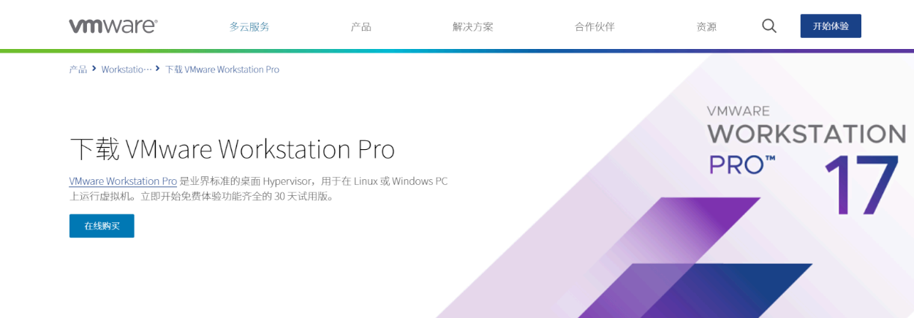

或者可以下载我们预留好的VMware 17.5版本，链接如下：

百度网盘：链接: https://pan.baidu.com/s/1eTJkIJ12U7XawNXxF8ijug?pwd=6711 提取码: 6711 

以下将以 **VMware 官网** 为例，介绍 VMware 的下载与安装流程。

在浏览器中打开

https://www.vmware.com/

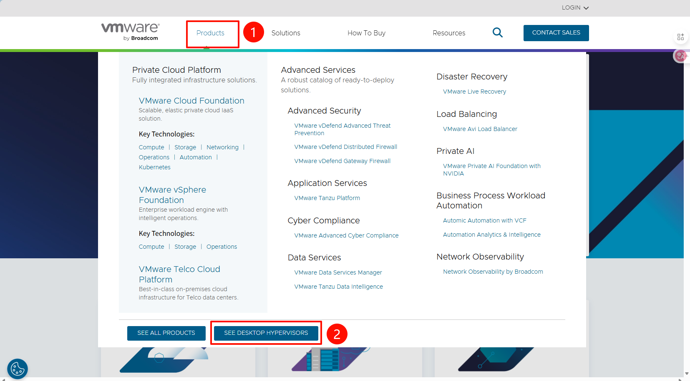

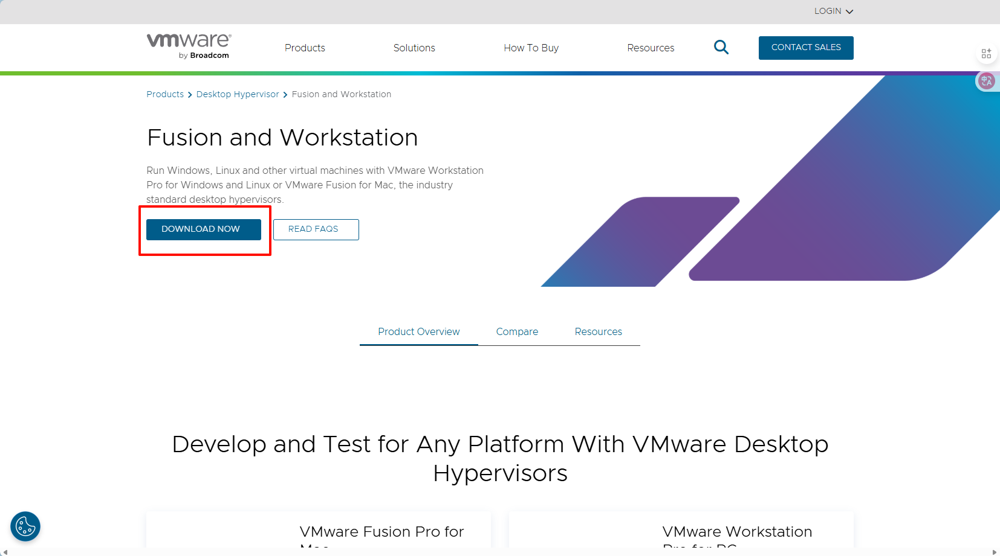

网站需要登陆，所以我们先进行注册

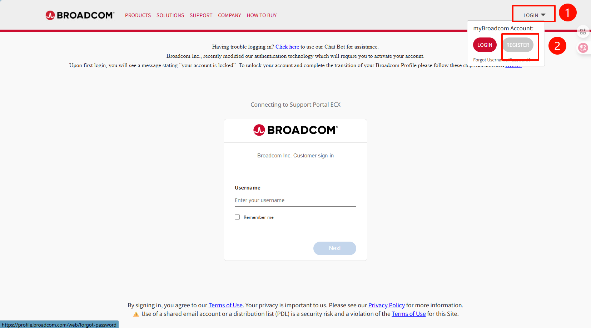

输入**自己的邮箱**进行注册

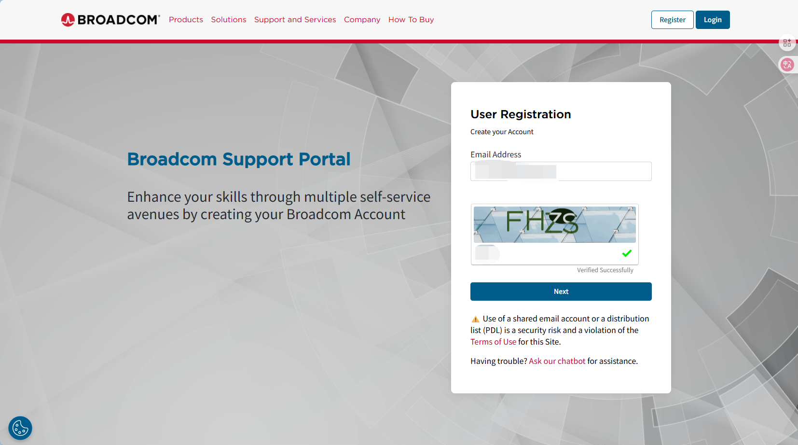

输入邮箱收到的**验证码**

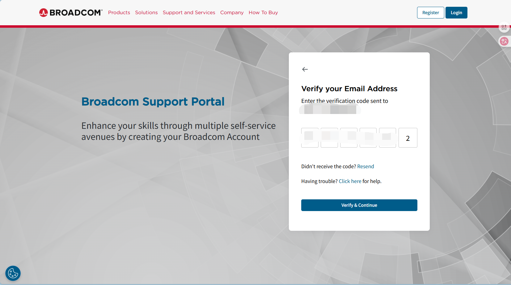

完成后，返回登陆界面输入账号（邮箱）与密码即可

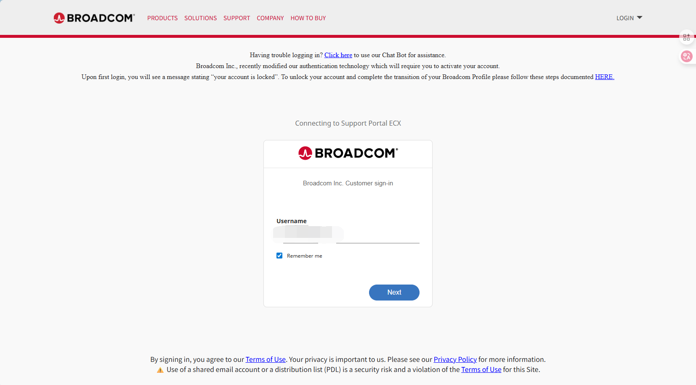

依次点击以下按钮

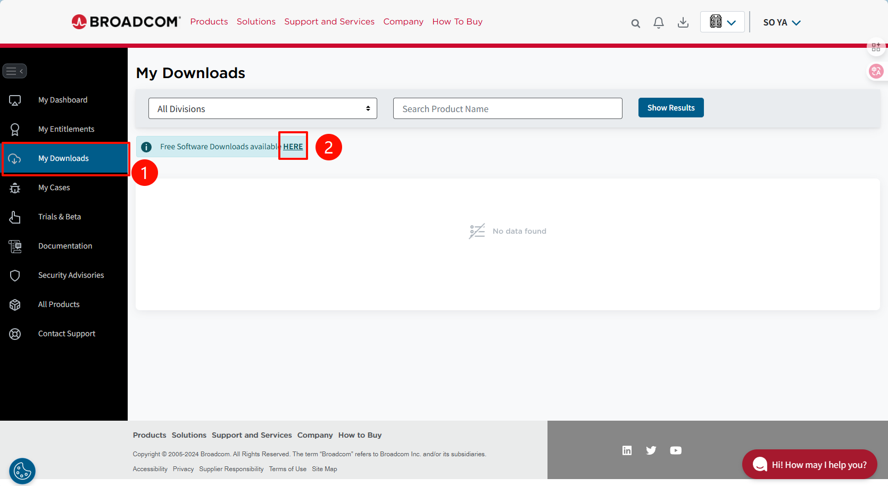

接着在搜索框中输入`VMware workstation`

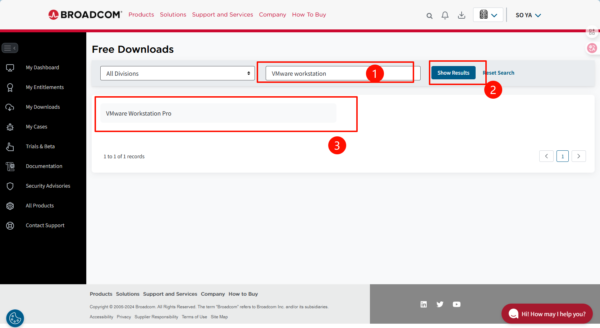

下载当前最新版即可

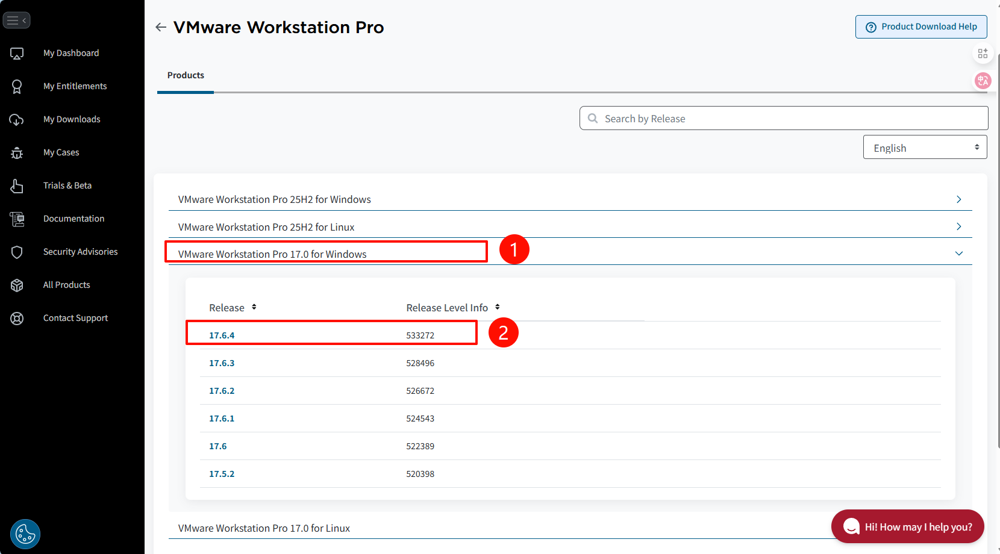

先阅读`Terms and Conditions`，再勾选

 

点击右侧按钮即可开始下载

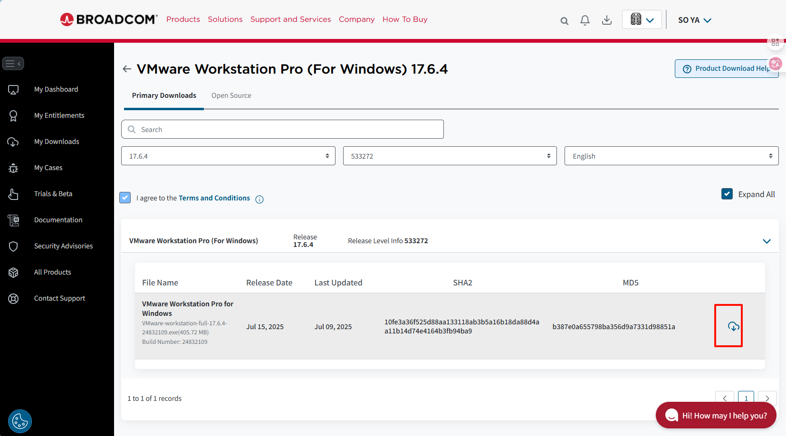

需要填一些地区之类的，随意写就好，填写完之后点击`submit`,等待跳转

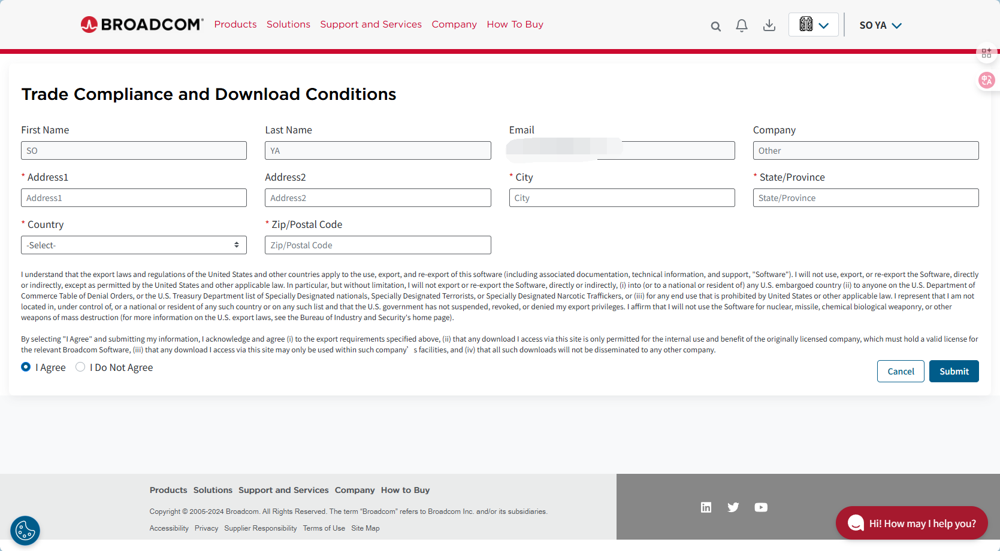

跳转完之后再次点击右侧按钮即可开始下载

等待安装，记住安装包的位置~

#### 安装VMware

先找一个磁盘空间比较充裕的盘，然后首先创建一个文件夹 `VMware` 

建好 `VMware` 大的目录后，我们还需要在这个目录下创建 `安装目录-VMware`和之后`创建虚拟机的存放目录-VMwaredate`

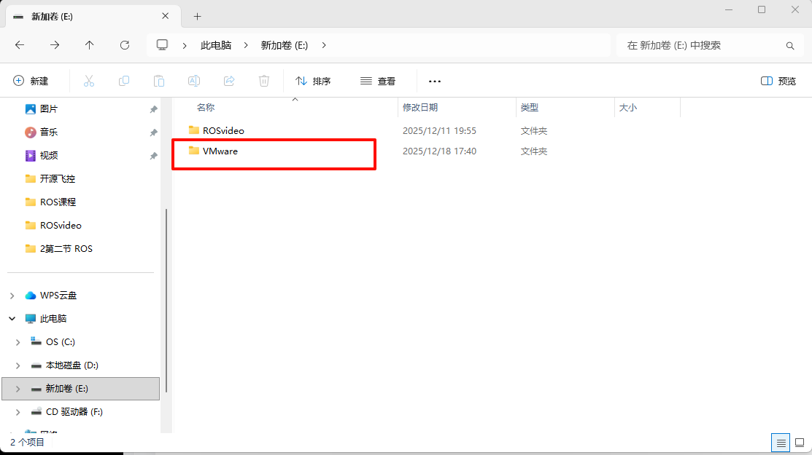

将我们上一节下载好VMware安装程序，以管理员身份运行：

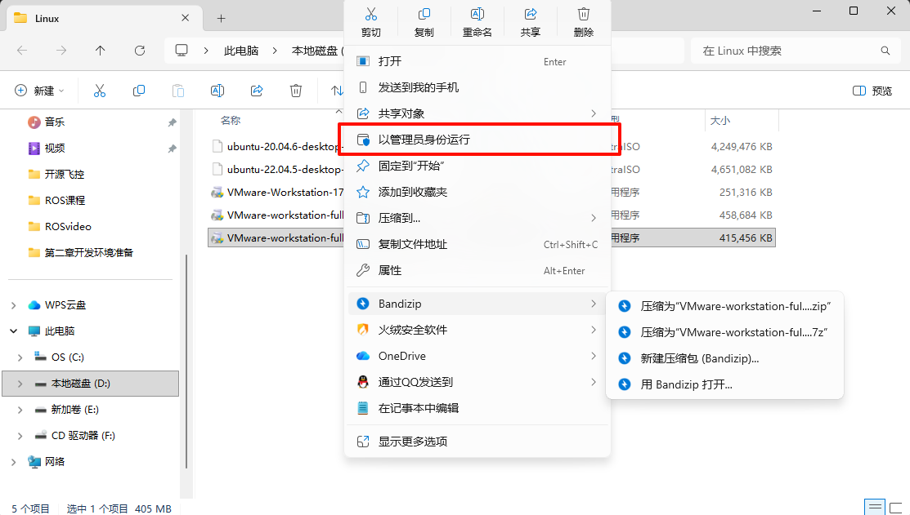

点完 `是` 以后这里需要稍微等待一会，才会显示安装界面：

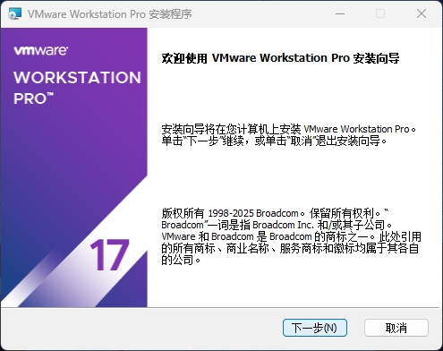

接收许可协议以后，点击 `下一步`：

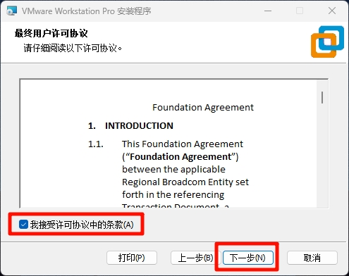

这里一定要点击 `更改...`，来更改安装位置，前文设置好的文件夹，选择我们刚刚创建的`VMware的安装目录`，然后点击`确定`：。

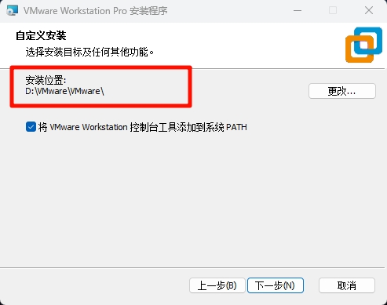

如果出现这个弹窗直接点 `确定`，如果没有出现直接跳过这一步。

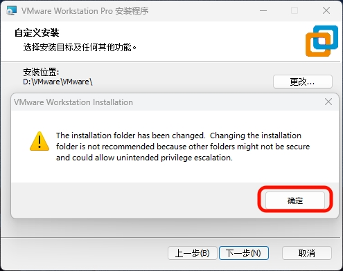

将 `启动时检查产品更新` 和 `加入 VMware 客户体验提升计划`取消勾选，然后点击`下一步`：

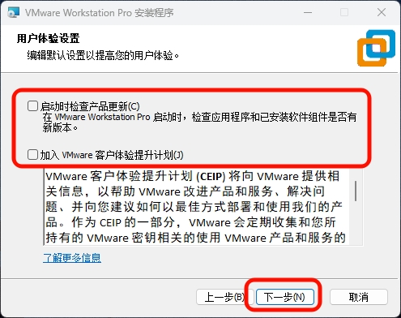

创建快捷方式，以方便寻找，并开始安装。

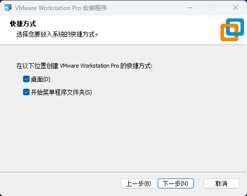

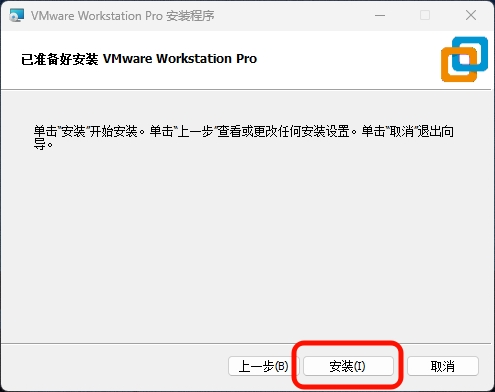

等待进度条跑完，安装完成：

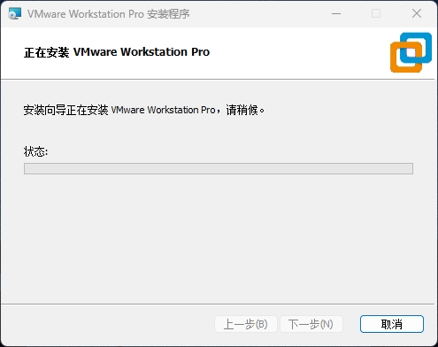

安装完成后会显示下面这个界面，直接点 `完成` 即可：

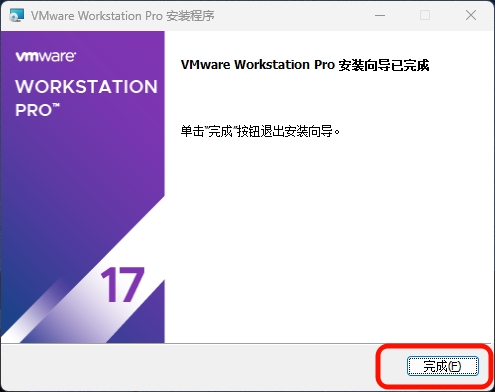

这样就安装完成了（电脑不同深色主题可能会对这个有影响，无伤大雅）。

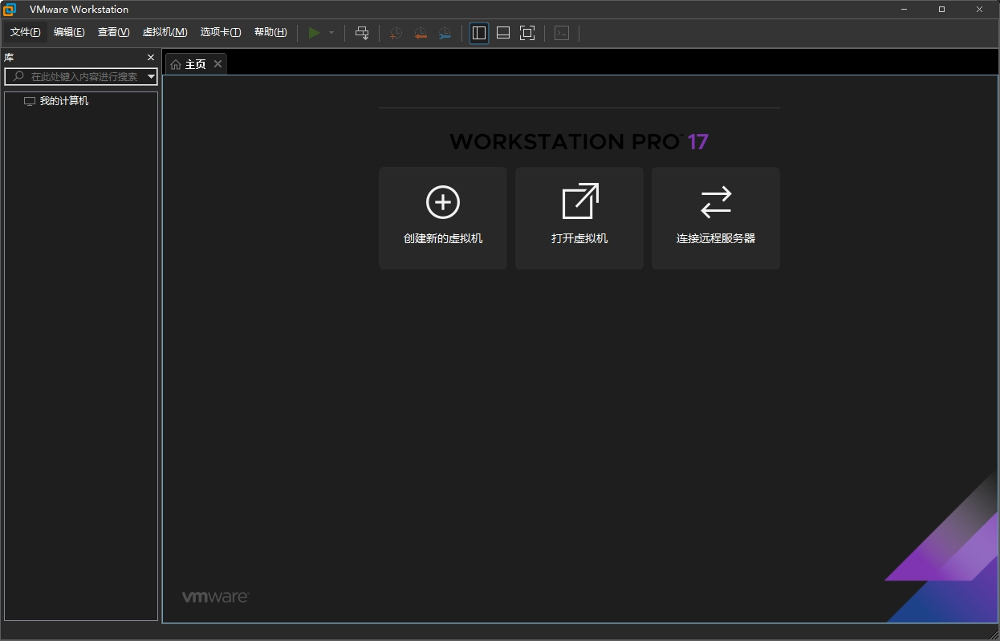

