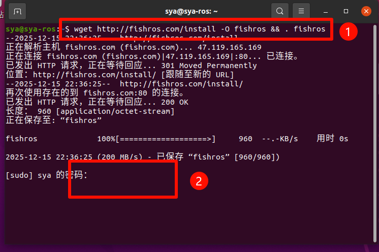
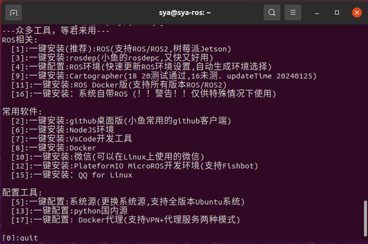
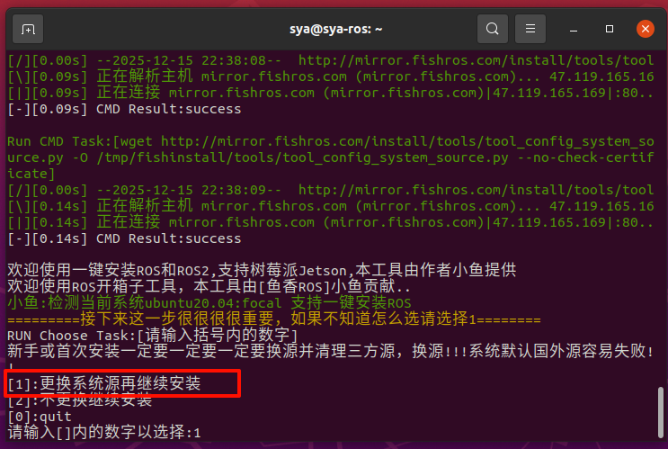
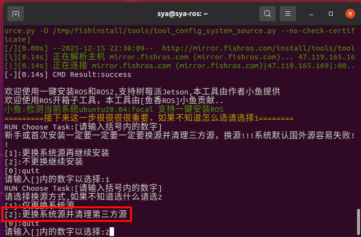
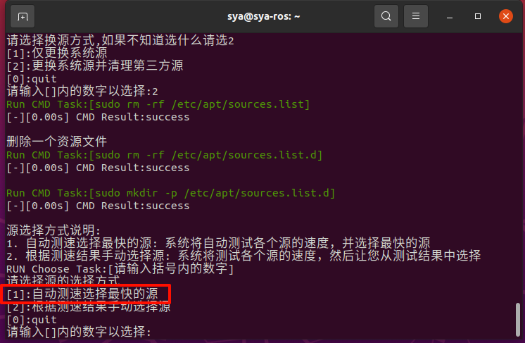
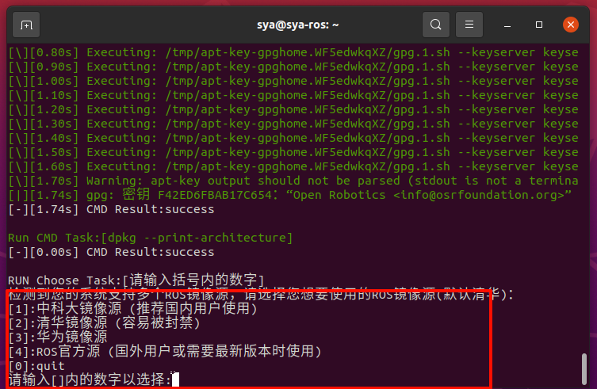
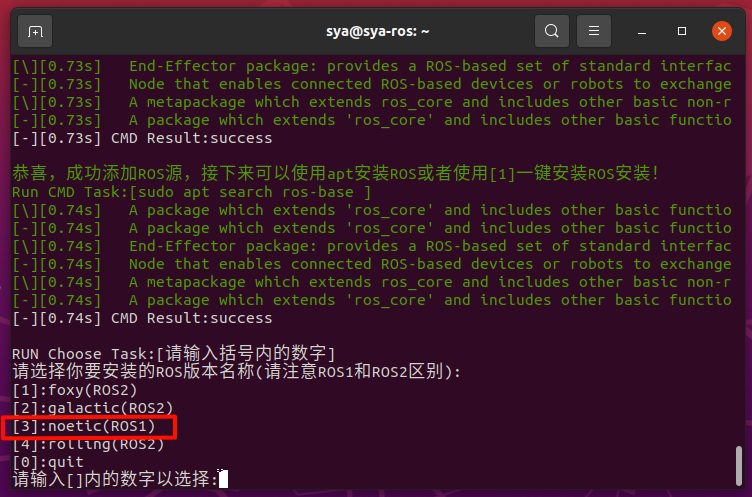
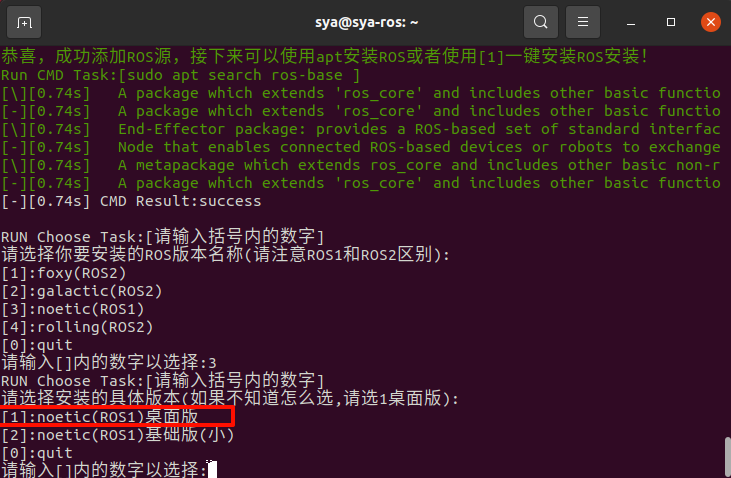
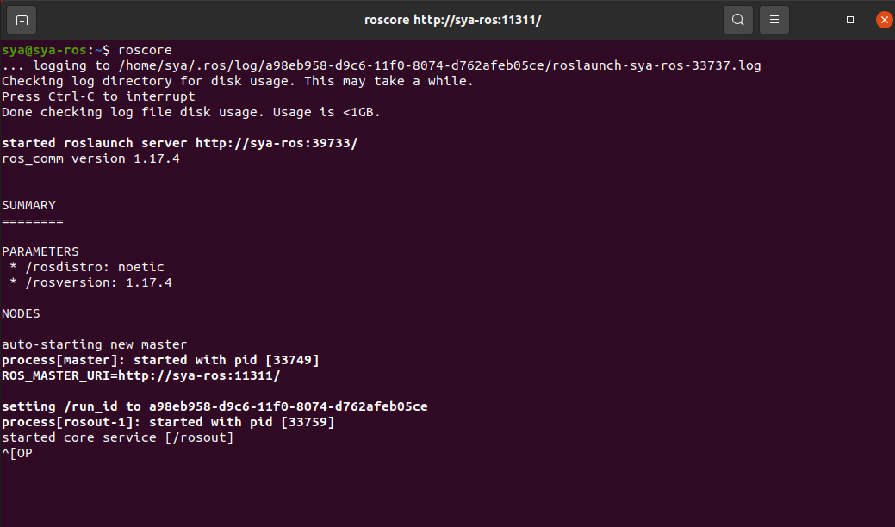

## 2.3 ROS安装

特别感谢 ♥ **鱼香ROS** ♥提供的一键安装指令，可大幅缩减安装流程时间！！！

> 本课程采用 FishROS 一键安装工具，是因为：
> - 自动处理国内软件源问题
> - 自动匹配 ROS1 Noetic 与 Ubuntu 20.04
> - 安装成功率高，适合教学环境

-----------------------------------------------------------------------

==补充：==

有同学反应这个地方没办法虚拟机与主机复制粘贴

以下是解决方案

载旧版本的open-vm-tools

> sudo apt-get autoremove open-vm-tools

更新软件源

> sudo apt-get update

安装

> sudo apt-get install open-vm-tools

安装open-vm-tools桌面组件，这个可以共享剪切板

> sudo apt-get install open-vm-tools-desktop

-----------------------------------------

打开终端，输入以下代码：

> wget http://fishros.com/install -O fishros && . fishros

输入密码略作等待

这里我们选择`1`

选择`1.更换系统源再继续安装` ，ps：系统源为.....

选择`2.更换系统源并清理第三方源`

选择`1:自动测速选择最快的源`

大概等待1分钟....

这个根据需求即可

选择`[3]:noetic(ROS1)`版本

选择`[1]:noetic(ROS1)桌面版`

等待安装即可，过程大概为15-20分钟

安装完成后打开一个新的终端，输入

> roscore

如下即`ROS1 noetic`安装成功

> roscore 用于启动 ROS Master，是所有 ROS 节点通信的基础

