## 2.4 Vs code安装与配置

VS Code（Visual Studio Code）是微软推出的一款轻量级代码编辑器，具有免费、开源和高扩展性的特点。它支持多种主流编程语言，提供语法高亮、智能代码补全、快捷键定制、代码片段管理、代码差异对比（Diff）以及 Git 版本控制等功能。通过丰富的插件生态，VS Code 可以灵活扩展功能，并对现代软件开发场景进行了良好适配。该编辑器支持 Windows、macOS 和 Linux 等主流操作系统。

同样的输入这段代码

> wget http://fishros.com/install -O fishros && . fishros

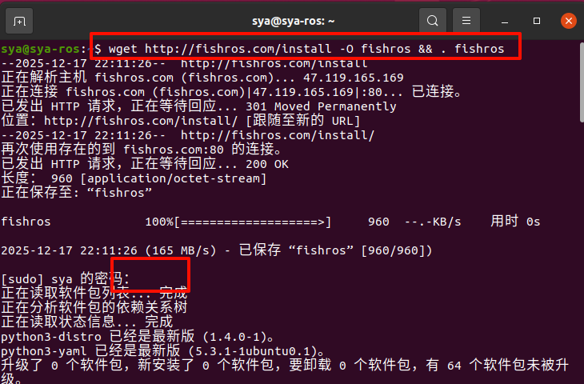

输入`7`

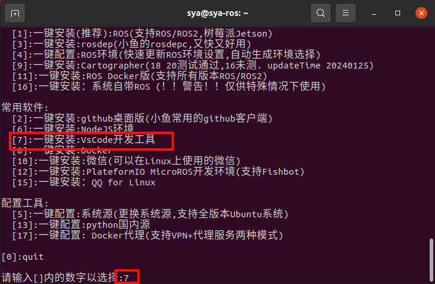

接着等待即可

可能有的同学会遇到这样的问题，输入`Y`即可

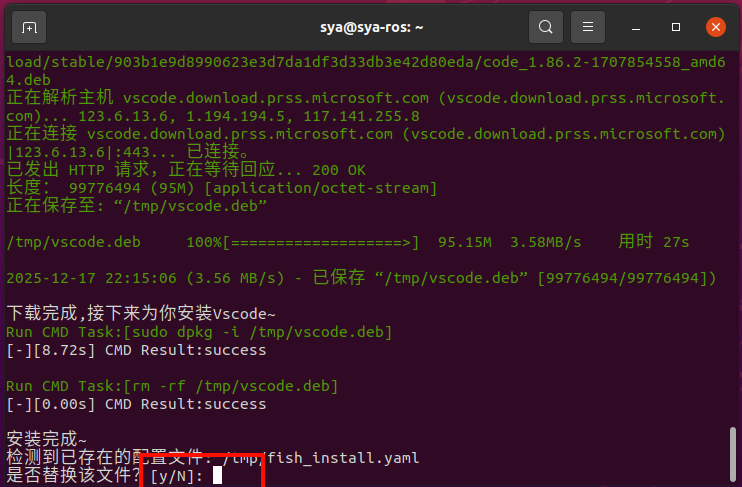

即可再工作台中看到下载好的`Visual Studio Code`

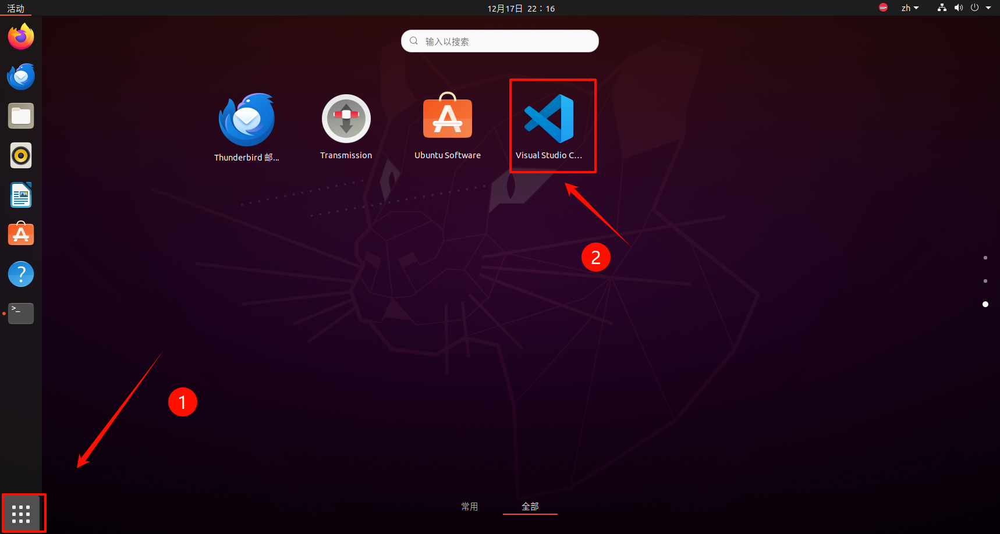

打开之后我们将其固定到收藏夹当中，以后打开会方便很多

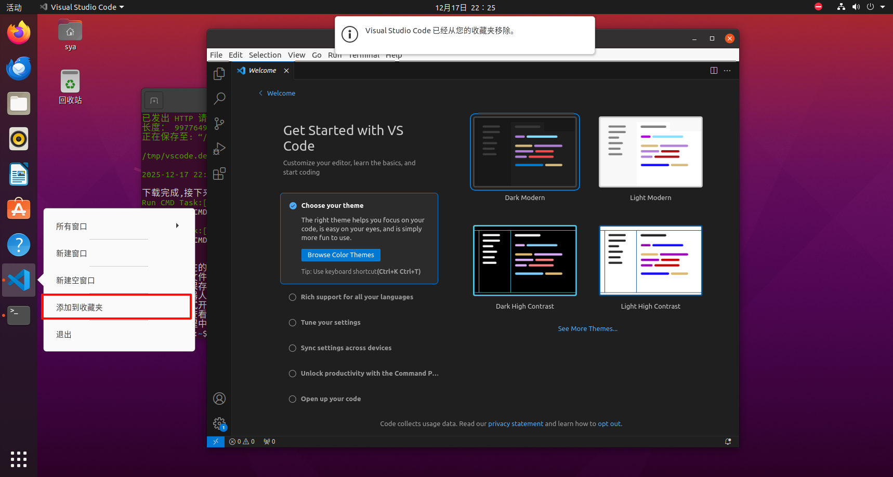

接下来我们配置一下

主要是安装以下几个插件`中文`、`ROS 1 插件（Robot Developer Extensions for ROS 1）`、`Cmake Tools`

| 插件        | 作用                           |
| ----------- | ------------------------------ |
| ROS 1 插件  | ROS 包识别、节点启动、语法提示 |
| CMake Tools | catkin 工程编译与调试          |
| 中文语言包  | 新手友好（可选）               |

 再vscode的左侧位置选择插件安装、并在搜索栏中找到自己所需要的插件即可

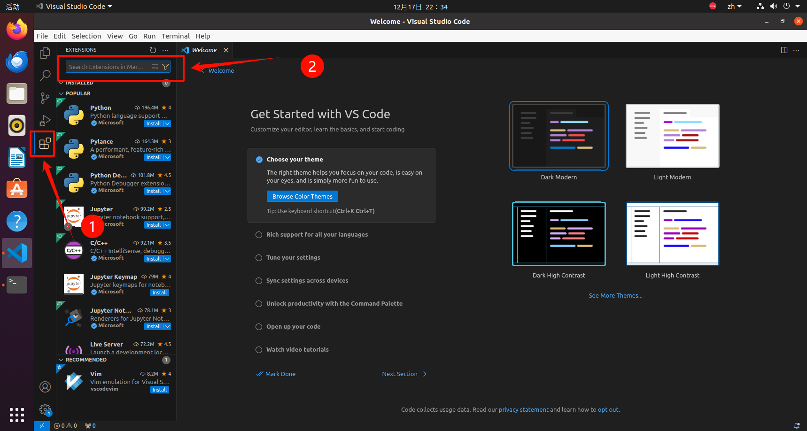

首先是中文插件（ 基础好的同学可以跳过），在搜索栏中输入`chinese`，并选择该插件进行安装

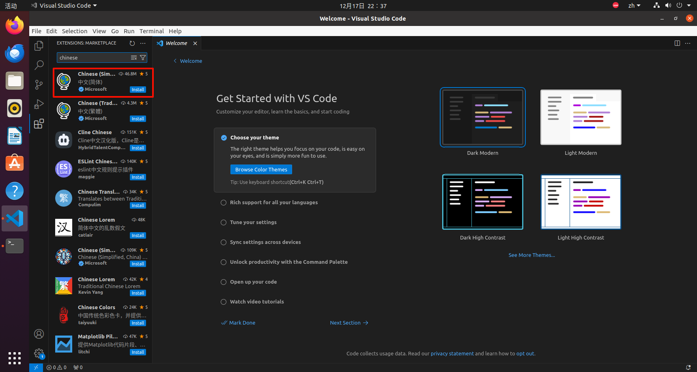

在安装完之后，会让我们重启vscode，点击该按钮即可

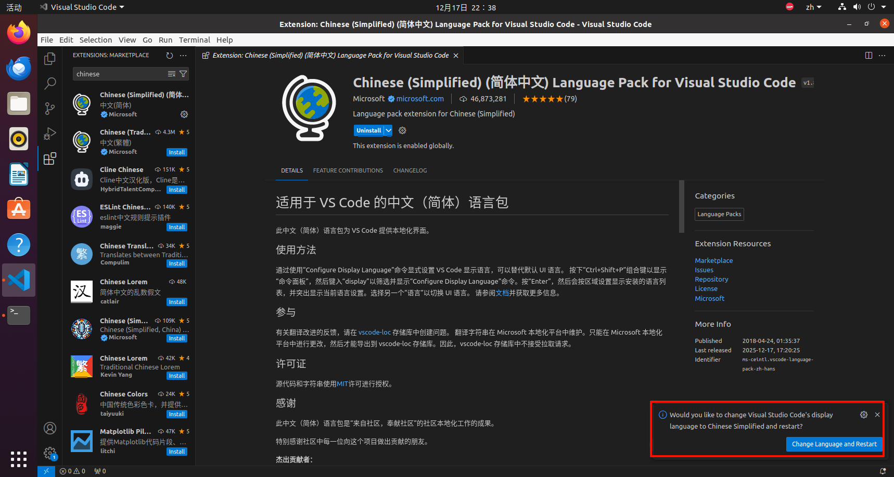

重启后可以看到，已经更改成功

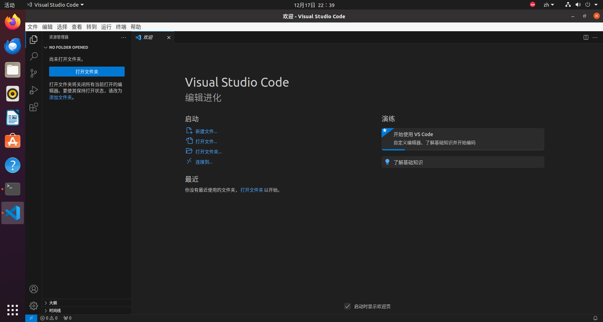

我们这里安装这个`Robot Developer Extensions for ROS 1`，这个版本能更好的支持我们这个版本的NOETIC和ROS1

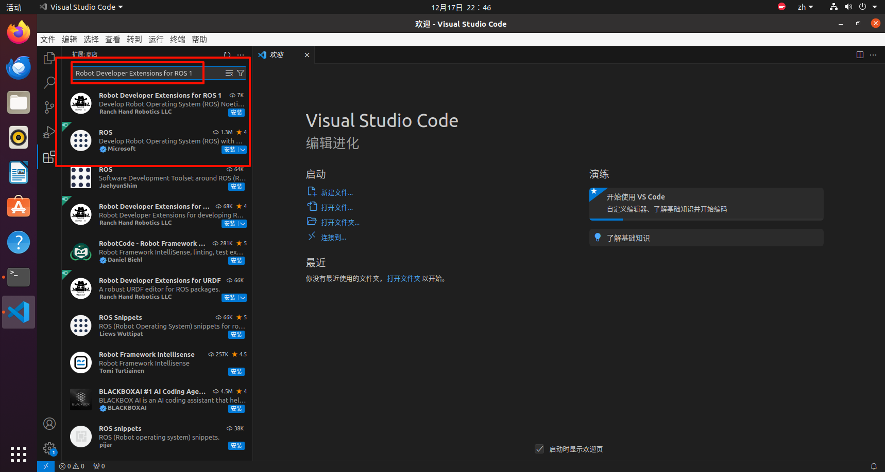

用同样的我们安装CMake Tools

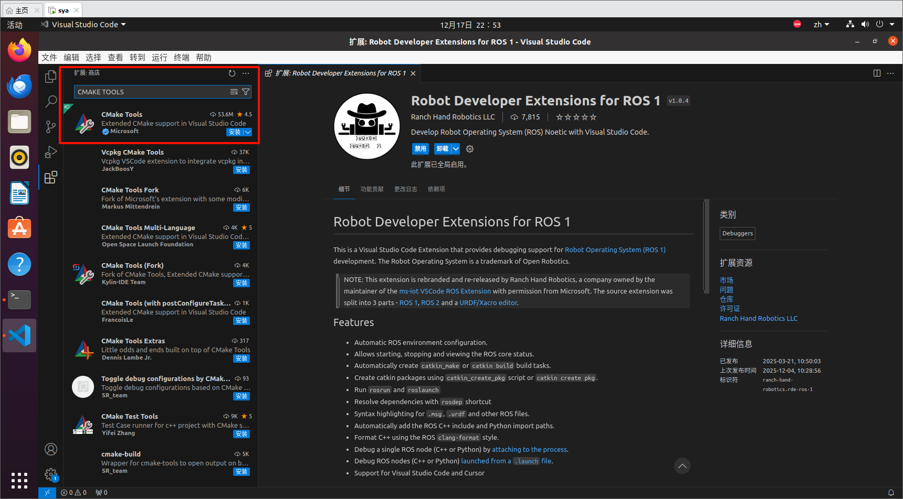

至此，我们基本的所有的前期准备工作已经就位，接下来的我们未来的视频也都会为大家介绍ROS的详细教程与我们安装的这些插件有什么具体的作用。

