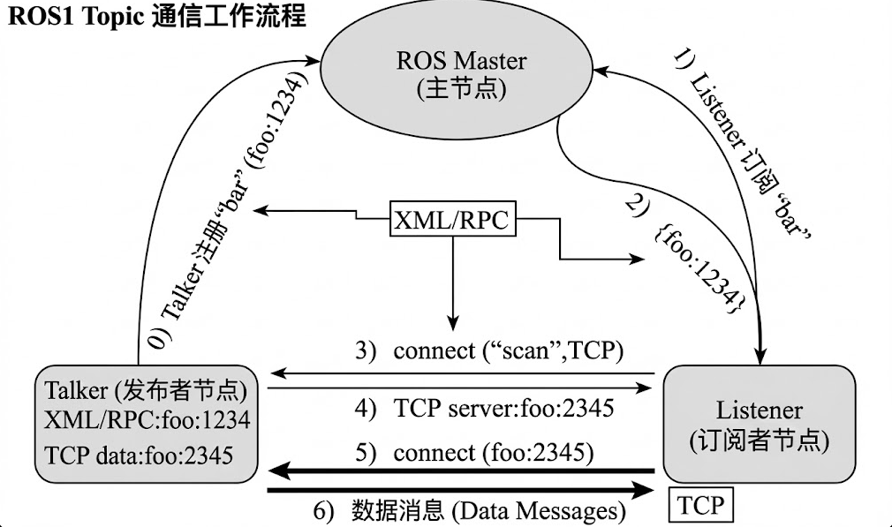

# 第四章 ROS通信机制

------

## 本章导读

在第三章中，我们已经完成了 ROS 系统的“骨架搭建”：

- 学会了创建工作空间与功能包
- 编写并运行了第一个 ROS 节点
- 使用 `launch` 管理多个节点
- 通过 `rqt_graph` 看到了节点之间的结构关系

但到目前为止，我们的节点**还没有真正“协同工作”**。

因此，本章将回答 ROS 学习中最关键的一个问题：

> **ROS 中的多个节点，是如何进行数据交换与协同控制的？**

------

## 本章学习目标

完成本章学习后，你将能够：

- 理解 ROS 中的核心通信机制及其设计思想
- 熟练使用 **Topic 话题通信** 实现节点间数据传输
- 理解 **Service 服务通信** 的同步调用模型
- 创建并使用自定义 `msg` 与 `srv`
- 使用命令行与可视化工具调试通信问题
- 独立完成一个基于 ROS 通信机制的完整小系统

------

## 4.1 ROS 通信模型总览

### 4.1.1 为什么 ROS 需要通信机制

机器人系统通常具备以下特点：

- 多个功能模块并行运行
- 传感器、控制器、规划算法相互独立
- 需要解耦、可扩展、可复用的架构

ROS 采用 **分布式通信模型**，使每个模块只关注自身职责，而不关心其他模块的内部实现。

------

### 4.1.2 ROS 三种核心通信方式

| 通信方式 | 特点             | 典型应用                 |
| :------- | ---------------- | ------------------------ |
| Topic    | 异步、持续、广播 | 传感器数据、速度控制     |
| Service  | 同步、请求-响应  | 参数设置、功能开关       |
| Action   | 可中断、带反馈   | 导航、机械臂运动（概念） |

📌 **教学说明**：
 本章重点掌握 **Topic 与 Service**，Action 仅做认知铺垫。

------

## 4.2 Topic 话题通信机制

### 4.2.1 Topic 通信基本概念

Topic 是 ROS 中**最常用的通信方式**，采用发布 / 订阅模型：

- **Publisher（发布者）**：负责发布数据
- **Subscriber（订阅者）**：负责接收数据
- **Message（消息）**：数据载体

特点：

- 发布者与订阅者互不感知
- 支持一对多、多对多通信
- 数据连续流动

------

### 4.2.2 Topic 通信工作流程



- 节点启动并向 ROS Master 注册
- Publisher 声明自己要发布某个 Topic
- Subscriber 声明自己要订阅某个 Topic
- ROS Master 负责建立节点之间的连接
- 数据在节点之间直接传输

------

### 4.2.3 使用命令行理解 Topic 通信

以小海龟为例：

```
roscore
rosrun turtlesim turtlesim_node
```

查看话题：

```
rostopic list
```

查看话题信息：

```
rostopic info /turtle1/cmd_vel
```

监听话题数据：

```
rostopic echo /turtle1/pose
```

------

## 4.3 编写 Topic 发布者与订阅者（C++）

一个发布者节点通常需要考虑：

- 发布的数据类型
- 发布频率
- 节点生命周期

------

### 4.3.1 编写 C++ Publisher 示例

**功能**：编写一个 ROS 节点，每秒向某个 Topic 发布一条字符串消息。

```
#include <ros/ros.h>
#include <std_msgs/String.h>

int main(int argc, char **argv)
{
    ros::init(argc, argv, "simple_publisher");
    ros::NodeHandle nh;

    // 创建 Publisher，发布到名为 "chatter" 的话题
    ros::Publisher pub =
        nh.advertise<std_msgs::String>("chatter", 10);

    ros::Rate rate(1);  // 每秒 1 次

    while (ros::ok())
    {
        std_msgs::String msg;
        msg.data = "Hello ROS Topic!";

        pub.publish(msg);
        ROS_INFO("Published: %s", msg.data.c_str());

        rate.sleep();
    }
    return 0;
}
```

- `advertise`：声明一个话题并准备发布

- `"chatter"`：话题名称

- `publish()`：真正发送消息

- `ros::Rate`：控制发布频率

  ---

### 4.3.2 编写 C++ Subscriber 示例

**功能**：编写一个 ROS 节点，订阅 `chatter` 话题，并打印接收到的消息。

```
#include <ros/ros.h>
#include <std_msgs/String.h>

// 回调函数：当有新消息到达时自动执行
void messageCallback(const std_msgs::String::ConstPtr &msg)
{
    ROS_INFO("Received: %s", msg->data.c_str());
}

int main(int argc, char **argv)
{
    ros::init(argc, argv, "simple_subscriber");
    ros::NodeHandle nh;

    // 订阅 chatter 话题
    ros::Subscriber sub =
        nh.subscribe("chatter", 10, messageCallback);

    // 等待并处理回调
    ros::spin();
    return 0;
}
```

- `subscribe()`：声明要订阅的话题
- 回调函数用于处理接收到的数据
- `ros::spin()`：保持节点运行，等待消息

------

## 4.4 编写 Topic 发布者与订阅者（Python）

本节将使用 **Python（rospy）**，在**完全相同的通信模型**下，再实现一次 Topic 通信。

> **ROS 的通信思想与语言无关，
> 不同语言只是“语法外壳不同”。**

### 4.4.1 编写 Python Subscriber 示例

**功能**：编写一个 Python 节点，每秒向 Topic `chatter` 发布一条字符串消息。

    #!/usr/bin/env python3
    import rospy
    from std_msgs.msg import String
    
    def main():
        # 初始化 ROS 节点
        rospy.init_node('simple_publisher')
    
        # 创建 Publisher，发布到 chatter 话题
        pub = rospy.Publisher('chatter', String, queue_size=10)
    
        rate = rospy.Rate(1)  # 1 Hz
    
        while not rospy.is_shutdown():
            msg = String()
            msg.data = "Hello ROS Topic (Python)!"
    
            pub.publish(msg)
            rospy.loginfo("Published: %s", msg.data)
    
            rate.sleep()
    
    if __name__ == '__main__':
        main()
    

- `Publisher()`：声明发布者
- `'chatter'`：话题名称
- `queue_size`：消息缓存队列大小
- `rospy.Rate()`：控制发布频率
- `rospy.is_shutdown()`：检测节点是否退出

### 4.4.2 编写 Python Publisher 示例

**功能**：编写一个 Python 节点，订阅 `chatter` 话题并打印接收到的内容。

    #!/usr/bin/env python3
    import rospy
    from std_msgs.msg import String
    
    def callback(msg):
        rospy.loginfo("Received: %s", msg.data)
    
    def main():
        # 初始化 ROS 节点
        rospy.init_node('simple_subscriber')
    
        # 订阅 chatter 话题
        rospy.Subscriber('chatter', String, callback)
    
        # 保持节点运行，等待回调
        rospy.spin()
    
    if __name__ == '__main__':
        main()
    

- `Subscriber()`：声明订阅关系
- `callback`：消息到达时自动执行
- `rospy.spin()`：阻塞等待回调

------

## 4.5 Service 服务通信机制

### 4.5.1 Service 是什么？

一句话定义：

> **Service 是 ROS 中用于“有请求、有响应”的同步通信机制。**

Service 的通信模型非常明确：

```
Client  —— 请求 ——>  Server
Client  <— 响应 ——   Server
```

Service 采用 **同步请求—响应模型**：

- 一次请求，对应一次响应
- 同步处理并返回结果（必须等返回）
- 调用期间客户端阻塞等待

**与topic对比**：

| 对比项   | Topic  | Service  |
| -------- | ------ | -------- |
| 通信模式 | 异步   | 同步     |
| 是否连续 | 是     | 否       |
| 典型用途 | 数据流 | 控制指令 |

> Topic     是“我说你听”，
>  Service 是“我问你答”。

------

## 4.6 使用 turtlesim 中的现成 Service

在编写 Service 程序之前，我们先**直接使用现有的 Service**，体会 Service 的行为。

------

### 4.6.1 启动小海龟节点

```
roscore
rosrun turtlesim turtlesim_node
```

------

### 4.6.2 查看系统中所有 Service

```
rosservice list
```

你会看到类似输出：

```
/clear
/kill
/reset
/spawn
/turtle1/teleport_absolute
/turtle1/set_pen
```

📌 说明：

> **每一个 Service 都是一个“可被请求的功能接口”。**

------

### 4.6.3 调用 Service：清空背景

```
rosservice call /clear
```

观察现象：

- 窗口立即被清空
- 命令立刻返回
- 没有持续通信

📌 这正是 Service 的典型特征。

------

### 4.6.4 查看 Service 结构

```
rosservice info /clear
```

再进一步：

```
rossrv show std_srvs/Empty
```

你会看到：

```
---
```

说明该 Service：

- 没有请求参数
- 没有响应数据
- 只是执行一次动作

------


### 4.6.5 使用 C++ Service Client 调用小海龟 Service

在真实工程中，Service 往往不是通过命令行调用，而是由程序触发。

下面通过 **C++ Service Client** 的方式来调用小海龟的瞬移服务。

------

### 示例：C++ 调用 `/teleport_absolute`

```
#include <ros/ros.h>
#include <turtlesim/TeleportAbsolute.h>

int main(int argc, char **argv)
{
    ros::init(argc, argv, "teleport_client");
    ros::NodeHandle nh;

    // 创建 Service Client
    ros::ServiceClient client =
        nh.serviceClient<turtlesim::TeleportAbsolute>(
            "/turtle1/teleport_absolute"
        );

    turtlesim::TeleportAbsolute srv;
    srv.request.x = 2.0;
    srv.request.y = 2.0;
    srv.request.theta = 0.0;

    // 调用 Service（阻塞）
    if (client.call(srv))
    {
        ROS_INFO("Teleport success!");
    }
    else
    {
        ROS_ERROR("Failed to call teleport service");
    }

    return 0;
}
```

###  本节小结

> Service 通信机制适合用于
>  **执行一次性、具有明确结果的控制命令**。
>
> 在小海龟示例中，
>  清屏、瞬移、生成或删除对象
>  都是典型的 Service 应用场景。
>
> 当你的需求是“让系统现在立刻做一件事”，
>  而不是持续发送数据时，
>  **Service 通常比 Topic 更合适。**


## 本章小结

本章围绕 **ROS 通信机制** 这一核心主题，系统讲解了节点之间如何进行数据交换与协同控制。

我们首先从整体通信模型出发，理解了 ROS 采用分布式、解耦式通信设计的原因，并明确了 ROS 中三种主要通信方式的定位。

随后，重点学习了 **Topic 话题通信机制**：

- 理解了发布 / 订阅模型
- 掌握了 Topic 的工作流程
- 分别使用 C++ 与 Python 实现了完整的 Publisher 与 Subscriber
- 通过命令行工具直观观察了数据流动过程

在此基础上，我们进一步学习了 **Service 服务通信机制**：

- 理解了同步请求—响应模型
- 明确了 Service 与 Topic 在使用场景上的根本区别
- 通过 turtlesim 示例，体验了 Service 执行“一次性控制命令”的典型应用
- 编写并运行了 C++ Service Client，完成了从程序层面调用 Service 的完整流程

通过本章学习，你已经不再只是“启动节点”，
 而是真正掌握了 **ROS 节点如何彼此通信、如何协同工作**。

> 从这一章开始，ROS 不再是“一堆命令和代码”，
>  而是一个**可被理解、可被设计、可被调试的系统**。